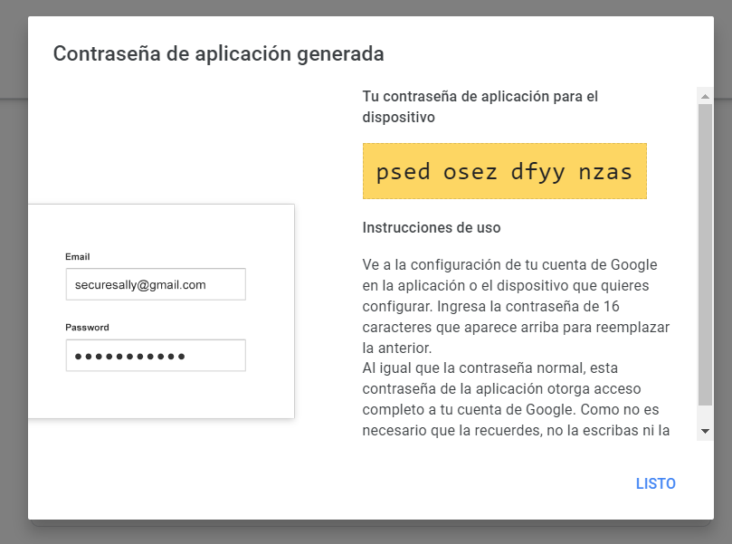

*** send Email ***
Sigamos los siguientes pasos:

1. Acceder a Administrar tu Cuenta de Google 

2. Seguridad 

3. Iniciar sesión en google 
4. Activar la verificación en dos pasos 

5. Creamos una contraseña de aplicaciones

6. Guardamos el token que nos genera

- Para instalar el módulo usamos 

- Para usarlos 

- Para envíar el email 

Almacenamos en una variable ya que nos devuelve un objeto literal y vamos a usar una propiedad para comparar luego

-Ahora usamos el método para comparar y le pasamos un valor a comparar con la propiedad sh de email

Esto nos devuelve un true si el código enviado es el mismo escrito por el usuario en nuestra aplicación

**Ejemplo** 

